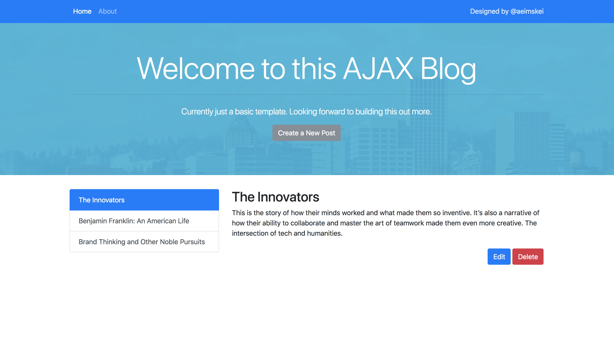

# Frontend or AJAX Blog
Client-side for Blog Application.

* Uses a CSS Framework
* Separates functions into multiple files
* Retrieves data from the backend (API created previously)

## Blog Post Routes
RESTful Architecture

* Read all Posts     => GET /posts
* Read Post By ID    => GET /posts/:id
* Create New Post    => POST /posts
* Update Post By ID  => PUT /posts/:id
* Destory Post BY ID =>DELETE /posts/:id

<kbd></kbd>